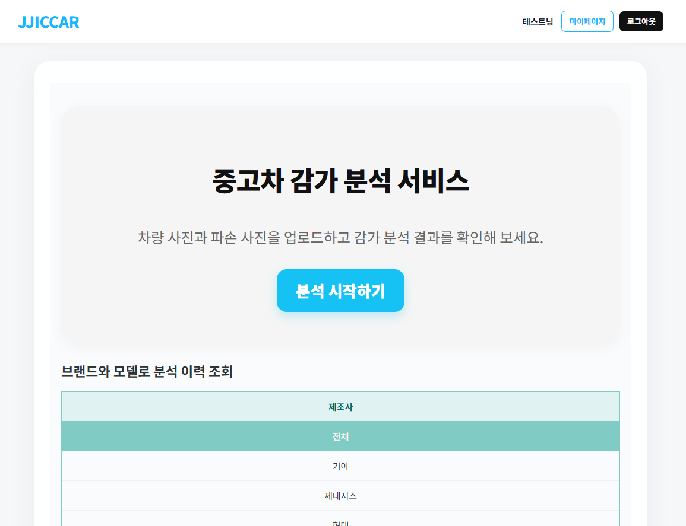
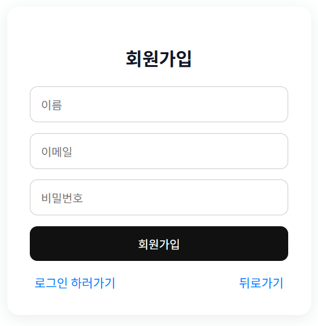
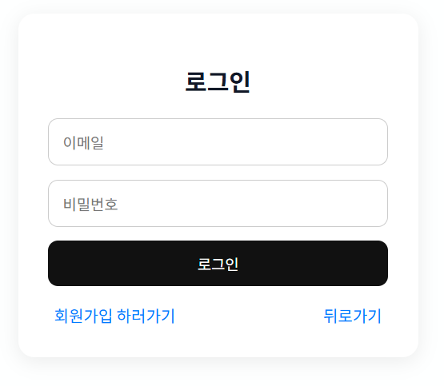
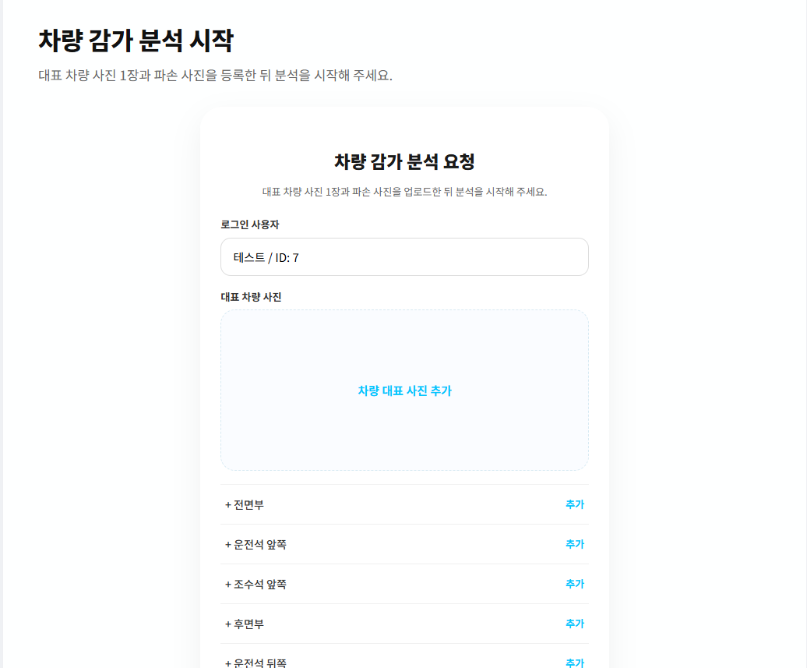
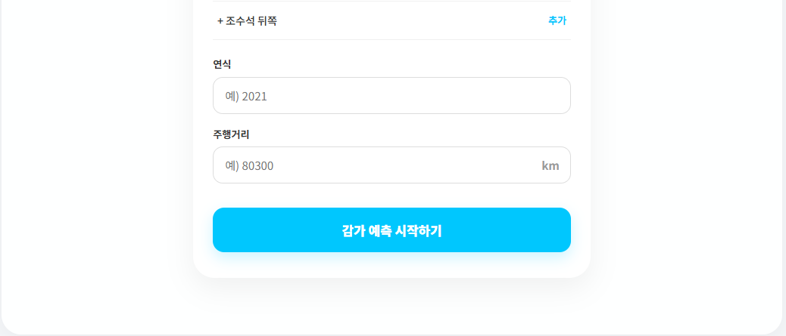
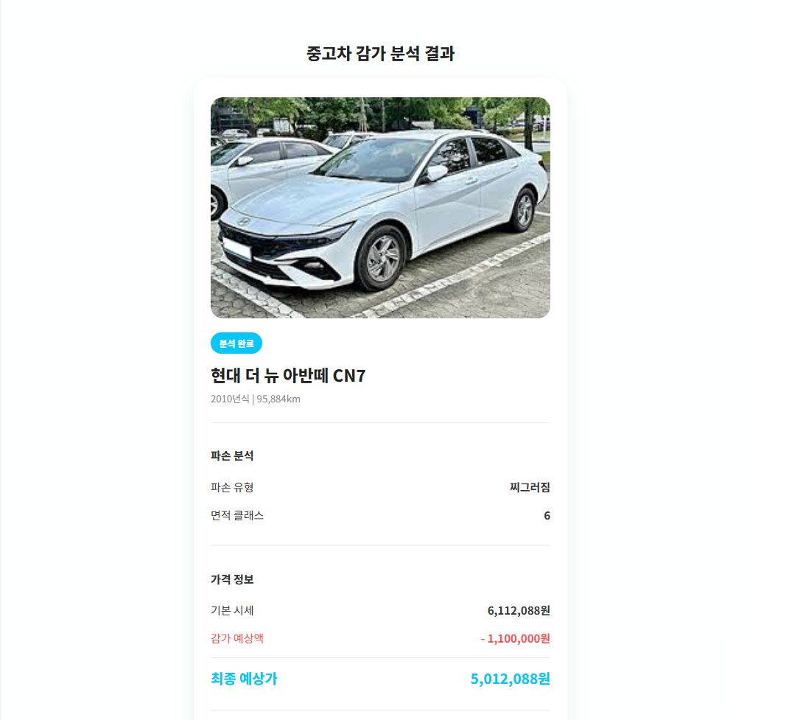
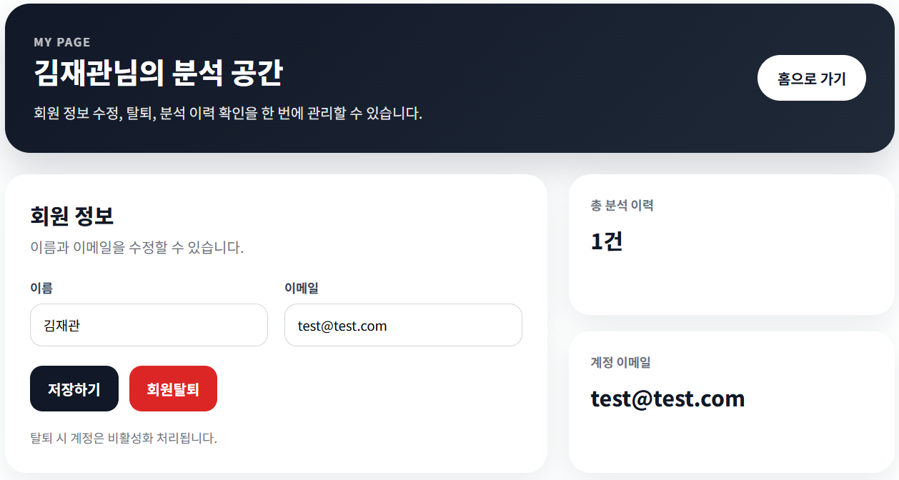
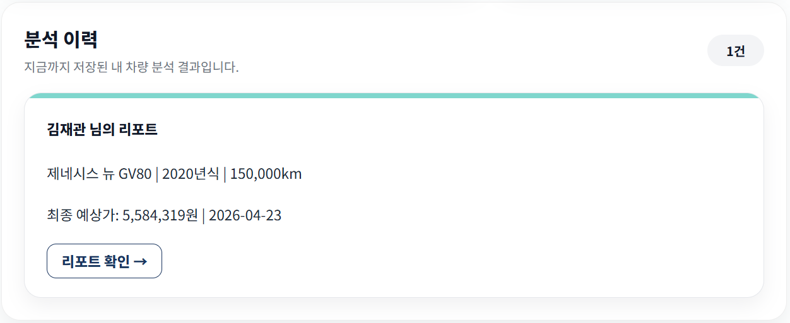
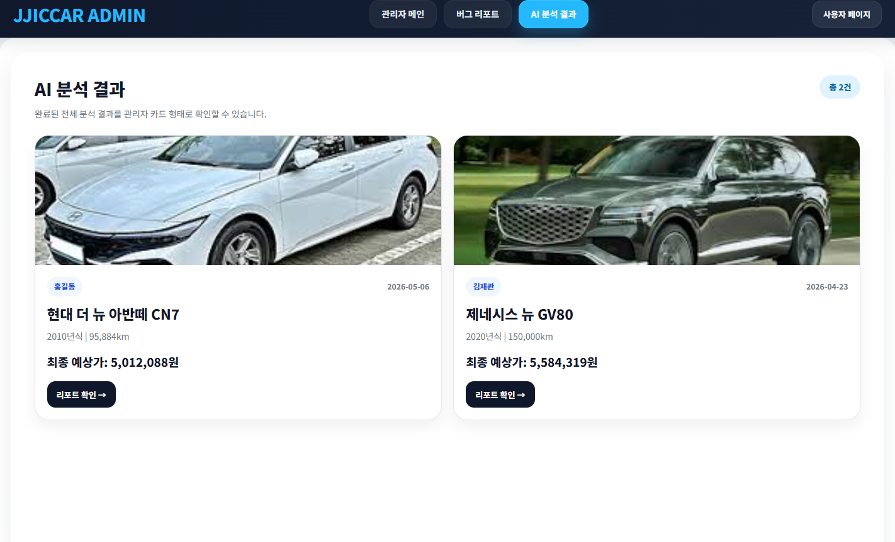
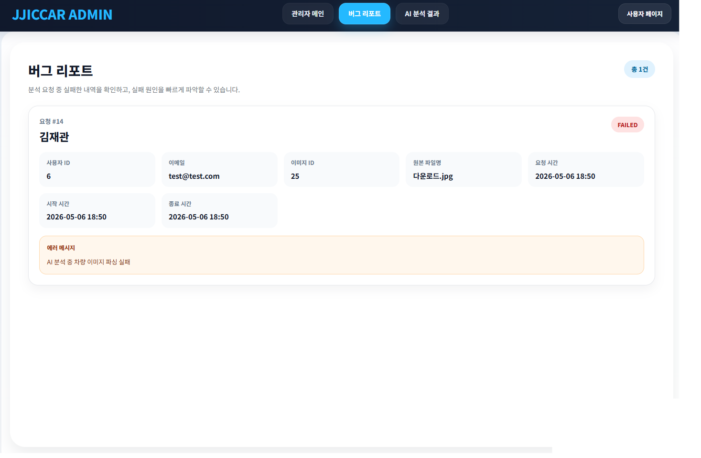

<div align="center">

# 🚗 JJICCAR
### 중고차 가격 예측 및 차량 파손 분석 서비스

<p>
  차량 이미지를 기반으로 <b>차종 분류</b>, <b>중고차 가격 예측</b>, <b>파손 분석</b>까지 연결한<br/>
  <b>React + Spring Boot + FastAPI</b> 기반의 풀스택 프로젝트입니다.
</p>

<p>
  
  
  
  
  
  
  
  
  
  
</p>

</div>

---

## 📌 프로젝트 소개

**JJICCAR**는 사용자가 차량 사진과 차량 정보(연식, 주행거리)를 업로드하면,
차량을 분류하고 중고차 가격을 예측한 뒤 파손 부위를 분석하여 감가 정보까지 제공하는 서비스입니다.

이 프로젝트는 **프론트엔드(React)**, **백엔드(Spring Boot)**, **AI 서버(FastAPI)** 를 분리하여 구성한 것이 특징이며,
회원 기능, 분석 이력 조회, 관리자 화면까지 포함한 형태로 구현되어 있습니다.


---

## ✨ 주요 기능

### 1. 회원가입 / 로그인 / 회원정보 관리
- 회원가입 및 로그인
- 회원탈퇴
- 사용자 프로필 수정
- 사용자 권한에 따라 일반 사용자 / 관리자 화면 분기



### 2. 차량 분석 요청
- 차량 대표 이미지 업로드
- 파손 이미지 다중 업로드
- 연식, 주행거리 입력
- Spring Boot 서버에서 업로드 파일 관리 후 AI 서버로 분석 요청



### 3. 차종 분류 + 가격 예측
- 차량 이미지를 기반으로 차종 분류
- YOLO 기반 차량 영역 crop 적용
- 분류 결과와 연식/주행거리를 결합하여 CatBoost 회귀 모델로 가격 예측

### 4. 파손 분석 및 감가 계산
- 파손 유형 분류 (스크래치, 찌그러짐, 파손)
- 손상 마스크 추론
- 손상 면적 기반 구간화
- 파손 유형/면적에 따라 감가율 및 감가 금액 계산

### 5. 결과 조회 / 마이페이지
- 분석 결과 상세 조회
- 사용자별 예측 이력 조회
- 브랜드/모델 기준 이력 조회 및 결과 상세 확인




### 6. 관리자 기능
- 관리자 전용 레이아웃 제공
- 분석 결과 카드 조회 화면
- 버그 리포트 조회 화면




---

## 🧠 AI 처리 흐름

```text
사용자 업로드
   ↓
React 프론트엔드
   ↓
Spring Boot 백엔드
   ↓
FastAPI AI 서버
   ├─ 차량 분류 (EfficientNet B0/B5 + YOLO crop)
   ├─ 가격 예측 (CatBoost)
   └─ 파손 분석 (EfficientNet-B2 + DeepLabV3+)
   ↓
백엔드 DB 저장
   ↓
프론트엔드 결과 화면 / 마이페이지 / 관리자 화면
```

---

## 🛠 기술 스택

### Frontend
- React
- React Router DOM
- Axios
- CSS
- Create React App

### Backend
- Java 17
- Spring Boot 4.0.5
- Spring Web
- Spring Data JPA
- Spring Security
- Spring Validation
- Lombok
- MariaDB

### AI Server
- FastAPI
- Uvicorn
- PyTorch
- TorchVision
- YOLOv8 (Ultralytics)
- CatBoost
- OpenCV
- Pillow
- Pandas / NumPy

---

## 🧩 프로젝트 구조

```bash
CarPredict_Project/
├─ ai-server/                  # FastAPI 기반 AI 분석 서버
│  ├─ app/
│  │  ├─ main.py               # /predict, /predict-damage API
│  │  ├─ predictor.py          # 차량 분류 + 가격 예측
│  │  ├─ damage_predictor.py   # 파손 분류 + 면적 분석 + 감가 계산
│  │  ├─ schemas.py
│  │  └─ utils.py
│  ├─ requirements.txt
│  ├─ usedcar_catboost_model.cbm
│  ├─ yolov8n.pt
│  └─ model1_model2_mapping_filled.json
│
├─ zzicar_project_back/        # Spring Boot 백엔드
│  ├─ src/main/java/com/example/nachajung/
│  │  ├─ config/
│  │  ├─ controller/
│  │  │  ├─ user/
│  │  │  │  ├─ AuthController.java
│  │  │  │  ├─ CarController.java
│  │  │  │  ├─ MyPageController.java
│  │  │  │  └─ VehicleController.java
│  │  │  ├─ BugReportController.java
│  │  │  └─ ReportController.java
│  │  ├─ dto/
│  │  ├─ entity/
│  │  ├─ repository/
│  │  ├─ service/
│  │  └─ NaChaGungApplication.java
│  └─ src/main/resources/application.properties
│
└─ zzicar_project_front/       # React 프론트엔드
   ├─ src/
   │  ├─ api/
   │  ├─ components/
   │  ├─ features/analysis/
   │  │  ├─ CarUploadForm.jsx
   │  │  ├─ DamageImageUploader.jsx
   │  │  └─ AnalysisResultCard.jsx
   │  ├─ pages/
   │  │  ├─ UploadPage.jsx
   │  │  ├─ ResultPage.jsx
   │  │  ├─ LoginPage.jsx
   │  │  ├─ SignupPage.jsx
   │  │  ├─ MyPage.jsx
   │  │  └─ admin/
   │  │     ├─ AdminLayout.jsx
   │  │     ├─ AdminMainPage.jsx
   │  │     ├─ AdminAnalysisCardsPage.jsx
   │  │     └─ BugReportPage.jsx
   │  └─ App.js
   └─ package.json
```

---

## 🔍 핵심 구현 포인트

### 1. 차량 이미지 기반 차종 분류
- `EfficientNet-B0`, `EfficientNet-B5` 두 모델을 함께 사용
- YOLOv8로 차량 영역을 검출하여 crop 후 추가 분류
- 두 모델의 확률값을 가중 평균하여 최종 차종 후보(top5) 생성

### 2. 이미지 + 정형 데이터 결합 가격 예측
- 차종 분류 결과를 매핑 정보와 연결
- 연식과 주행거리 기반 파생 변수를 생성
  - 차량나이
  - 차량나이²
  - log(주행거리)
  - 연간 주행거리
- CatBoost 회귀 모델을 사용해 예측 가격 산출

### 3. 파손 유형 분류 및 면적 분석
- `EfficientNet-B2`로 파손 유형 분류
- `DeepLabV3+`로 손상 영역 segmentation
- 손상 면적(pixel)을 구간화하여 area class 산정
- 파손 유형별 base rate와 면적 multiplier를 조합해 감가 금액 계산

### 4. 프론트/백엔드/AI 서버 분리 구조
- 프론트엔드는 사용자 입력과 결과 UI 담당
- 백엔드는 인증, DB 저장, 파일 업로드, API 오케스트레이션 담당
- AI 서버는 모델 추론 전용으로 분리하여 분석 처리 담당

---

## 📡 주요 API

### 인증
```http
POST /api/auth/signup
POST /api/auth/login
POST /api/auth/withdraw
PATCH /api/auth/profile/{userId}
```

### 차량 분석
```http
POST /api/car/analyze
GET  /api/car/brands
GET  /api/car/models?brandId={id}
GET  /api/car/results/{id}
GET  /api/car/history?brandName=&modelName=&page=0&size=5
```

### 마이페이지
```http
GET /api/mypage/{userId}/predictions
```

### 관리자
```http
GET /api/admin/bug-reports
POST /api/predict
```

### AI 서버
```http
POST /predict
POST /predict-damage
```

---

## 🖥 화면 구성

### 사용자 화면
- 메인 화면
- 로그인 / 회원가입
- 차량 업로드 화면
- 분석 결과 화면
- 마이페이지

### 관리자 화면
- 관리자 메인 페이지
- 분석 결과 카드 페이지
- 버그 리포트 페이지

---

## 🧪 실행 방법

### 1. AI 서버 실행
```bash
cd ai-server
pip install -r requirements.txt
uvicorn app.main:app --reload --port 8000
```

### 2. 백엔드 실행
```bash
cd zzicar_project_back
./gradlew bootRun
```

### 3. 프론트엔드 실행
```bash
cd zzicar_project_front
npm install
npm start
```

---

## ⚙ 환경 설정

백엔드 `application.properties` 기준 예시:

```properties
spring.application.name=socar_v1
server.port=8080

spring.datasource.url=jdbc:mariadb://localhost:3306/nachajeong
spring.datasource.username=YOUR_DB_USERNAME
spring.datasource.password=YOUR_DB_PASSWORD
spring.datasource.driver-class-name=org.mariadb.jdbc.Driver

spring.jpa.hibernate.ddl-auto=update
spring.jpa.show-sql=true
spring.jpa.properties.hibernate.format_sql=true
spring.jpa.database-platform=org.hibernate.dialect.MariaDBDialect

ai.base-url=http://localhost:8000
app.upload.car-dir=C:/zzicar_project/ai-server/usecars/fastapi_shared/car
app.upload.damage-dir=C:/zzicar_project/ai-server/usecars/fastapi_shared/damage
```

> 공개 저장소에 로컬 DB 계정과 경로 정보가 보일 수 있으므로, 실제 README에는 위처럼 예시값으로 바꿔 적는 것을 권장합니다.

---

## 📈 기대 효과

- 이미지와 정형 데이터를 결합한 실용적인 차량 평가 흐름 구현
- AI 추론 서버를 별도로 두어 역할을 분리한 구조 설계 경험 확보
- 사용자 기능과 관리자 기능을 함께 갖춘 서비스형 프로젝트 완성
- 가격 예측과 파손 감가 분석을 연결한 도메인 특화 서비스 구현

---

## 🚀 향후 개선 방향

- JWT 기반 인증 구조 고도화
- 모델 성능 지표(정확도, RMSE, MAE 등) 시각화
- 배포 환경 구성 및 CI/CD 추가
- 업로드 이미지 저장소 분리
- 관리자 대시보드 통계 기능 강화
- 예측 결과 리포트 PDF 출력 기능 추가

---

## 🙋‍♂️ 내가 맡은 역할 예시

포트폴리오용 README로 다듬을 때는 아래처럼 적을 수 있습니다.

```md
- React 기반 사용자 화면 구현 및 라우팅 구성
- Spring Boot 기반 회원 기능 및 분석 API 연동
- 차량 분석 요청/결과 저장 흐름 구현
- FastAPI 기반 AI 서버 연동 및 추론 결과 반환 구조 설계
- 마이페이지 및 관리자 화면 구현
```

---

## 📎 Repository

- GitHub: `kimjaegwan0218/CarPredict_Project`

